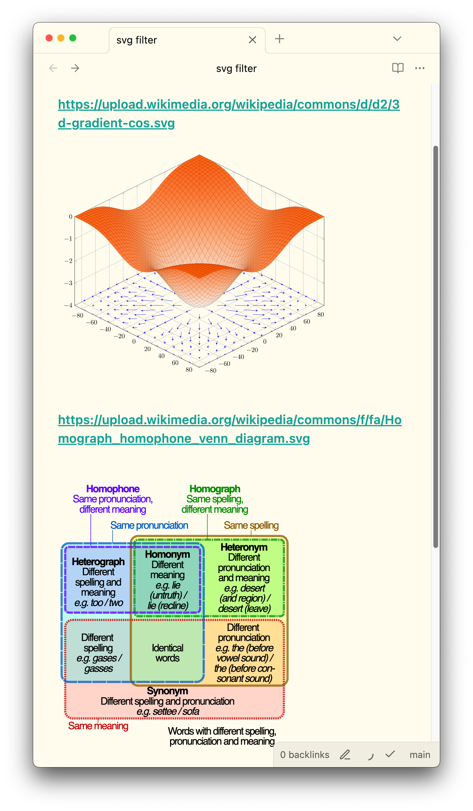
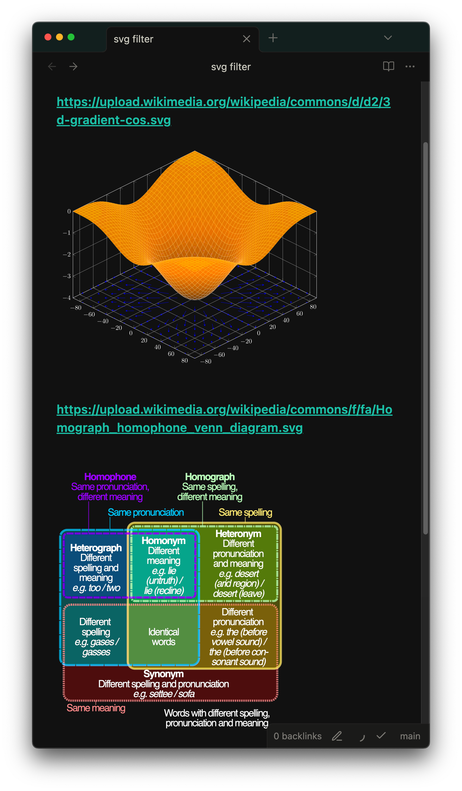

# Dark Mode SVG Filter

An Obsidian plugin that automatically applies a hue-preserving invert filter to SVG images in dark mode for better visibility. This ensures that SVG graphics remain clearly visible and properly contrasted when switching between light and dark themes.

## Features

- 🎨 Automatically applies SVG filter to images in dark mode
- 🌈 Preserves original hues while inverting luminance
- ⚡ Zero configuration required - works immediately after installation
- 🔄 Seamlessly toggles with theme changes
- 📱 Works on both desktop and mobile versions of Obsidian

## How It Works

Previously, simple CSS invert filters like `filter: invert(1) hue-rotate(180deg);` were used, but these made some colors look weird. (see: [Forum Discussion](https://forum.obsidian.md/t/looking-for-the-perfect-color-inversion-css-for-embedded-excalidraw-drawing/73123) and [Stack Overflow](https://stackoverflow.com/a/58402100/13713934))

This plugin uses a better approach based on [this solution](https://monochrome.sutic.nu/2024/02/25/hue-preserving-invert-css-filter-for-dark-mode.html) that preserves hues while inverting luminance.

The plugin:
1. Injects an SVG filter `<filter id="invert-luminance" color-interpolation-filters="linearRGB">` into the DOM
2. Applies `filter: url(#invert-luminance);` to all SVG images when in dark mode
3. Automatically removes the filter in light mode

## Installation

### From Community Plugins (Recommended)
1. Open Obsidian Settings
2. Go to Community Plugins and disable Safe Mode
3. Click Browse and search for "Dark Mode SVG Filter"
4. Install and enable the plugin

### Manual Installation
1. Download the latest release from [GitHub Releases](https://github.com/adielbm/obsidian-darkmode-svg-filter/releases)
2. Extract the files to `your-vault/.obsidian/plugins/darkmode-svg-filter/`
3. Reload Obsidian
4. Enable the plugin in Community Plugins settings

## Screenshots

| Light Mode | Dark Mode |
|------------|-----------|
|  |  |

## Development

### Prerequisites
- Node.js
- npm or yarn

### Building
```bash
# Install dependencies
npm install

# Build the plugin
npm run build

# Development mode (watch for changes)
npm run dev
```

### Project Structure
- `main.ts` - Main plugin code
- `manifest.json` - Plugin metadata
- `versions.json` - Version compatibility info
- `styles.css` - Plugin styles (currently unused)

## Contributing

Contributions are welcome! Please feel free to submit a Pull Request.

## License

This project is licensed under the MIT License - see the [LICENSE](LICENSE) file for details.

## Acknowledgments

- Based on the hue-preserving invert filter technique by [monochrome.sutic.nu](https://monochrome.sutic.nu/2024/02/25/hue-preserving-invert-css-filter-for-dark-mode.html)
- Inspired by discussions in the Obsidian community about better dark mode SVG handling