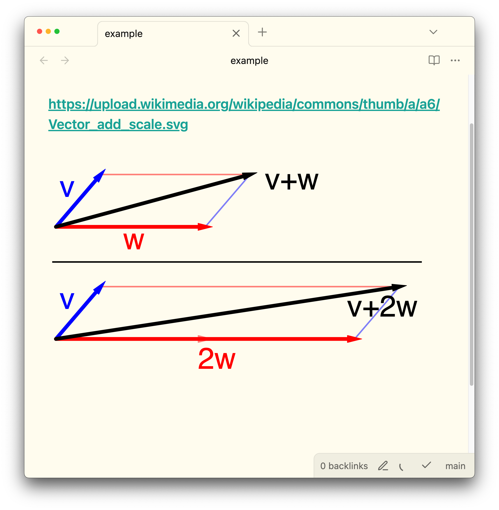
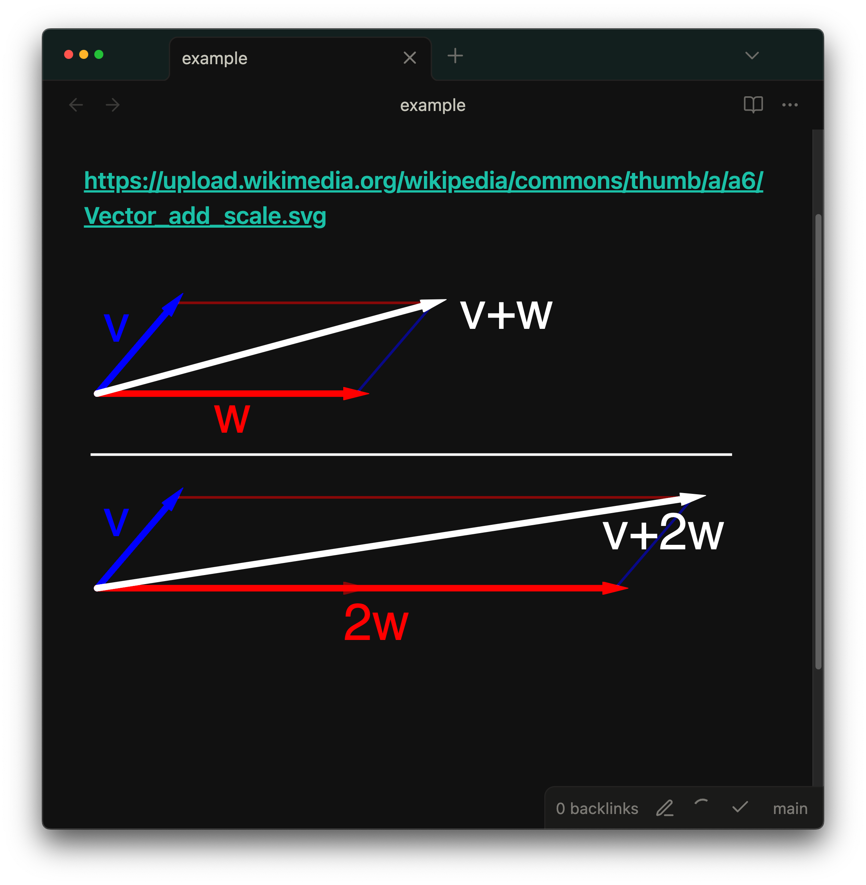

An Obsidian plugin that automatically applies an invert filter to images in dark mode for better visibility. This ensures that images remain clearly visible and properly contrasted when switching between light and dark themes.

| Light Mode | Dark Mode |
|------------|-----------|
|  |  |
|  |  |

# How it works

Previously, I made this using `filter: invert(1) hue-rotate(180deg);`, but it made some colors look weird. (see: [https://forum.obsidian.md/t/looking-for-the-perfect-color-inversion-css-for-embedded-excalidraw-drawing/73123](https://forum.obsidian.md/t/looking-for-the-perfect-color-inversion-css-for-embedded-excalidraw-drawing/73123) and [https://stackoverflow.com/a/58402100/13713934](https://stackoverflow.com/a/58402100/13713934))

This one, which is better, is based on this solution: [https://monochrome.sutic.nu/2024/02/25/hue-preserving-invert-css-filter-for-dark-mode.html](https://monochrome.sutic.nu/2024/02/25/hue-preserving-invert-css-filter-for-dark-mode.html).

In short, it adds an SVG filter `<filter id="invert-luminance" color-interpolation-filters="linearRGB">` and applies `filter: url(#invert-luminance);` to all SVG images in dark mode.

# Development


after making changes and pushing to master, we can release a new version as follows:

```bash
# Update version from 1.0.0 to 1.0.1
# assume package.json version is 1.0.0
npm version patch # updates package.json to 1.0.1. (or npm version minor/major for 1.1.0/2.0.0)
# run the following script to update manifest.json and versions.json
npm run version
# commit changes
git tag -a 1.0.1 -m "1.0.1"
git push origin 1.0.1
```
